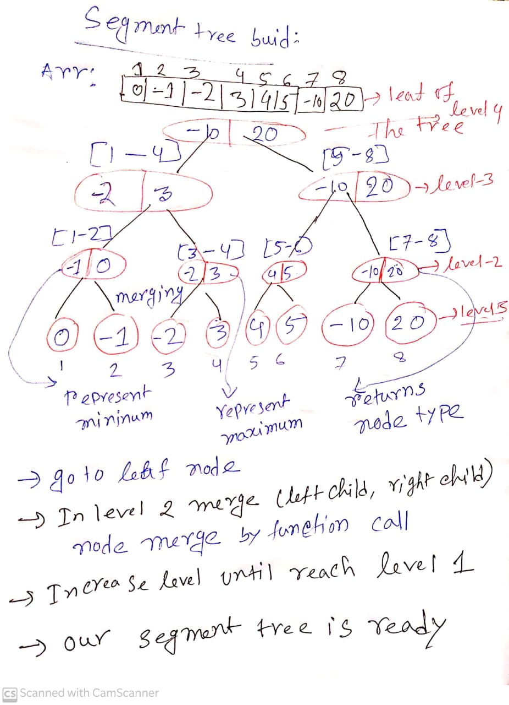

[Easy segment tree](https://kartikkukreja.wordpress.com/2014/11/09/a-simple-approach-to-segment-trees/)

# Observation
- <font size="4">We build segment tree from an array to do some query
- Segment tree works in range and implement by merge sort algorithm method
- We create balanced binary tree so that we maintain tree size in **(log<sub>n</sub>)** time 
- we divide the range in two equal parts and maintain some information in every child of tree according to our purpose
- First of all , all the elements of the array will be leaf of our tree
- take every step we take two elements and merge them 
and build a binary tree and every node has two children  which represent some range and some properties

<div align ="center">

**Fig 1**</div>

# Template

```c++
node assign leaf(int x){
       node ans;
       ans.min=x;
       ans.max=x;
       ans.sum=x;
       return ans;
}
node merge(node& left,node& right){
    node ans;
    ans.min=min(left.min,right.min);
    ans.max=max(left.max,right.max);
    ans.sum=left.sum+right.sum;
    return ans;
}
void build(int stindex,int lo,int hi){
    if(lo==hi){
        seg[stindex]=assign leaf(arr[lo]);
        return;
    }
    int left=2*stindex,right=left+1,mid=(lo+hi)/2;
    build(left,lo,mid);
    build(right,mid+1,hi);
    seg[stindex]=merge(seg[left],seg[right]);
}
