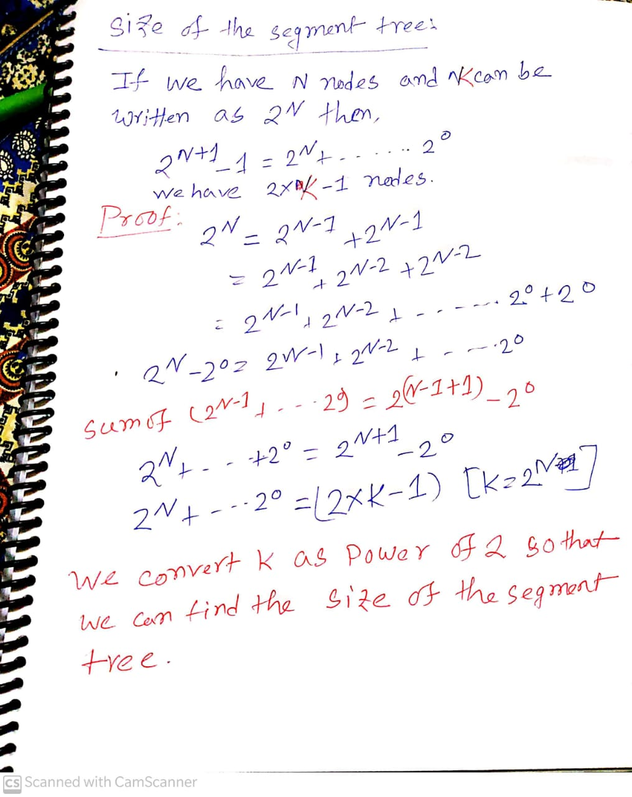

# Observation
- <font size ="4">Each node here shows the segment of the input array for which it is responsible. The number outside a node indicates its index in the segment tree array. Clearly, if the array size N were a power of 2, then the segment tree would have 2*N-1 nodes. It is simpler to store the first node at index 1 in the segment tree array in order to simplify the process of finding indices of left and right children (a node at index i has left and right children at 2*i and 2*i+1 respectively). Thus, for an input array of size N, an array of size 2*N would be required to store the segment tree.
- Graphical representation 
<div align="center">

**Here is the proof** </div>

# Template 
```c++
int getSegmentTreeSize(int N) {
  int size = 1;
  for (; size < N; size <<= 1);
  return size << 1;
}
```
- Convert N into power of 2